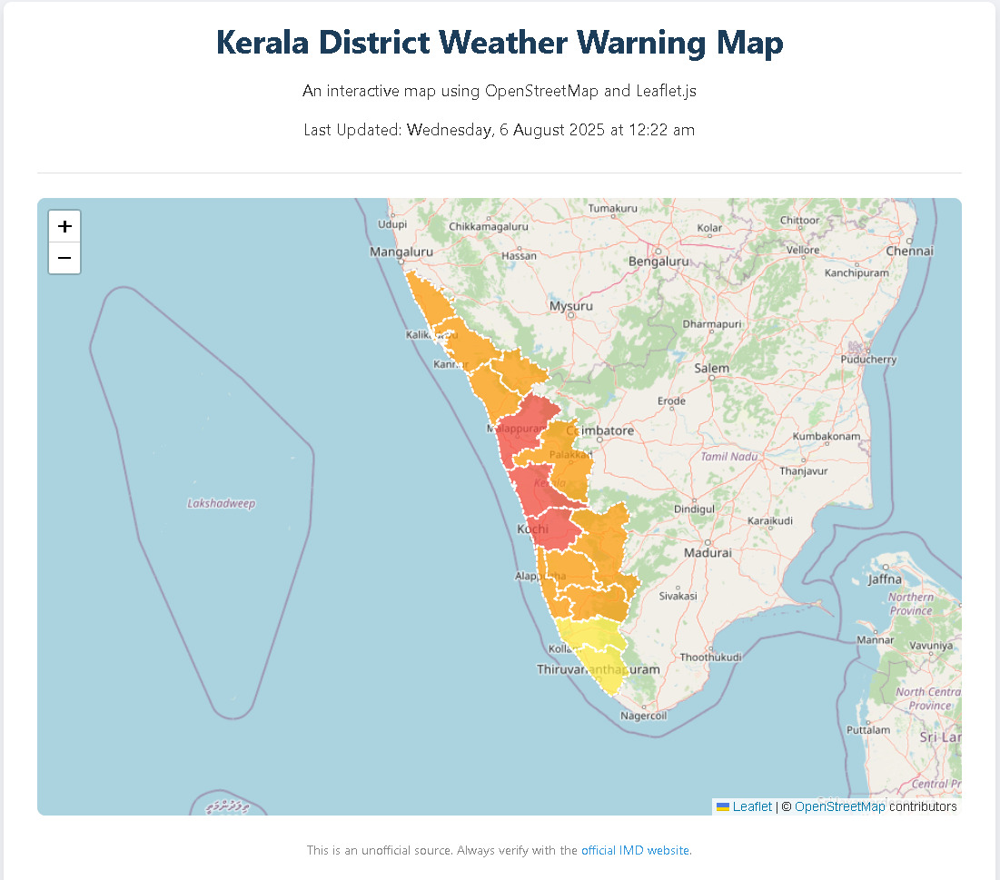

# Kerala Weather Warning Dashboard


Automated district-level weather warnings for Kerala, India — scraped from the India Meteorological Department (IMD) and displayed on an interactive choropleth map.

## Live demo

**[kerala-weather-warning.vercel.app](https://kerala-weather-warning.vercel.app/)**

## Screenshot



## Features

- **Automated scraping** — A GitHub Action runs every 12 hours to fetch the latest warning data via Playwright.
- **Interactive map** — Leaflet.js and OpenStreetMap provide a zoomable, pannable view of Kerala.
- **Data visualization** — Districts are color-coded (Red, Orange, Yellow, Green, or Grey) by current IMD alert level.
- **CI/CD pipeline** — The scraper commits updated data to the repository; Vercel deploys the site automatically.

## How it works

| Step | Component | Action | Result |
| :--: | :-- | :-- | :-- |
| 1 | GitHub Actions | Runs on a 12-hour schedule or manual trigger | A fresh VM starts the job |
| 2 | Playwright scraper | Executes `npm run scrape` against the IMD site | Generates `public/data.json` |
| 3 | GitHub Actions | Commits the updated data file | Pushes an "Automated data update" commit |
| 4 | Vercel | Receives a webhook from the new push | Triggers a new deployment |
| 5 | Vercel | Pulls the latest code and data | Publishes the `public` folder to the live URL |
| 6 | Browser | Loads the deployed site | Fetches `data.json` and renders the colored map |

## Tech stack

| Layer | Tools |
| :-- | :-- |
| Scraper / automation | Node.js, Playwright, GitHub Actions |
| Frontend | HTML, CSS, JavaScript, Leaflet.js, GeoJSON |
| Hosting | Vercel |

## Local setup

1. **Clone the repository**

   ```bash
   git clone https://github.com/RICH132/Kerala-Weather-Warning.git
   cd Kerala-Weather-Warning
   ```

2. **Install dependencies**

   ```bash
   npm install
   ```

3. **Install Playwright browsers**

   ```bash
   npx playwright install --with-deps
   ```

4. **Generate initial data**

   ```bash
   npm run scrape
   ```

5. **Start the local server**

   ```bash
   npm start
   ```

   Open [http://localhost:3000](http://localhost:3000) in your browser.

## Disclaimer

This is an unofficial project for educational purposes. Data is sourced from the IMD. For official use, always refer to the [IMD website](https://mausam.imd.gov.in/).

## License

MIT License.
